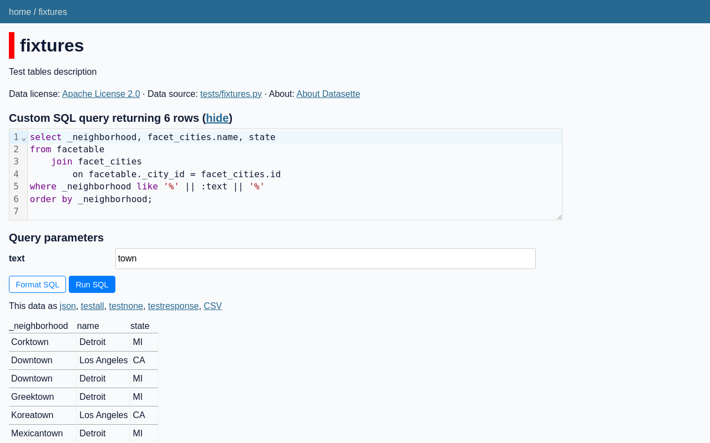
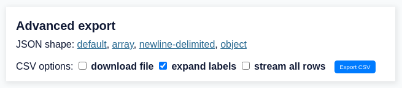
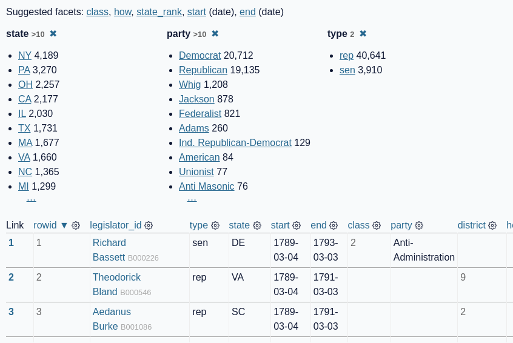

# datasette-screenshots

Screenshots of Datasette, taken using [shot-scraper](https://github.com/simonw/shot-scraper) running in GitHub Actions in [this repository](https://github.com/simonw/datasette-screenshots).

<!-- [[[cog
import cog, yaml
from pathlib import Path
shots = yaml.safe_load(open("shots.yml"))
for shot in shots:
    cog.out("## {}\n\n".format(shot["output"]))
    cog.out("- Retina: [{output}]({output}) - {size} KB\n".format(
        output=shot["output"],
        size=Path(shot["output"]).stat().st_size // 1024,
    ))
    cog.out("- Non-retina: [non-retina/{output}](non-retina/{output}) - {size} KB\n".format(
        output=shot["output"],
        size=(
            Path("non-retina") / shot["output"]
        ).stat().st_size // 1024,
    ))
    cog.out("\n```yaml\n{}```\n\n".format(yaml.dump([shot])))
    cog.out('\n\n'.format(
        output=shot["output"]
    ))
]]] -->
## global-power-plants.png

- Retina: [global-power-plants.png](global-power-plants.png) - 665 KB
- Non-retina: [non-retina/global-power-plants.png](non-retina/global-power-plants.png) - 206 KB

```yaml
- height: 1600
  output: global-power-plants.png
  url: https://global-power-plants.datasettes.com/global-power-plants/global-power-plants?_facet_size=5&country_long=United+States+of+America
  wait: 5000
```


## faceting.png

- Retina: [faceting.png](faceting.png) - 188 KB
- Non-retina: [non-retina/faceting.png](non-retina/faceting.png) - 79 KB

```yaml
- height: 800
  output: faceting.png
  url: https://congress-legislators.datasettes.com/legislators/executive_terms?_facet=type&_facet=party
```


## sql-query.png

- Retina: [sql-query.png](sql-query.png) - 150 KB
- Non-retina: [non-retina/sql-query.png](non-retina/sql-query.png) - 65 KB

```yaml
- height: 800
  output: sql-query.png
  url: https://latest.datasette.io/fixtures?sql=%0Aselect+_neighborhood%2C+facet_cities.name%2C+state%0Afrom+facetable%0A++++join+facet_cities%0A++++++++on+facetable._city_id+%3D+facet_cities.id%0Awhere+_neighborhood+like+%27%25%27+%7C%7C+%3Atext+%7C%7C+%27%25%27%0Aorder+by+_neighborhood%3B%0A&text=town
```



## tutorials-clean-data-locations-map.png

- Retina: [tutorials-clean-data-locations-map.png](tutorials-clean-data-locations-map.png) - 609 KB
- Non-retina: [non-retina/tutorials-clean-data-locations-map.png](non-retina/tutorials-clean-data-locations-map.png) - 225 KB

```yaml
- height: 1200
  output: tutorials-clean-data-locations-map.png
  url: https://manatees.vercel.app/manatees/locations
  wait: 1500
```


## tutorials-clean-data-facets.png

- Retina: [tutorials-clean-data-facets.png](tutorials-clean-data-facets.png) - 148 KB
- Non-retina: [non-retina/tutorials-clean-data-facets.png](non-retina/tutorials-clean-data-facets.png) - 65 KB

```yaml
- output: tutorials-clean-data-facets.png
  selectors:
  - .facet-results
  - header
  url: https://manatees.vercel.app/manatees/locations?_nocol=latitude&_nocol=longitude&_facet=DCODE&_facet=MORTALITY
```


## regmem-search.png

- Retina: [regmem-search.png](regmem-search.png) - 120 KB
- Non-retina: [non-retina/regmem-search.png](non-retina/regmem-search.png) - 2 KB

```yaml
- height: 585
  output: regmem-search.png
  url: https://register-of-members-interests.datasettes.com/regmem/items?_search=hamper&_sort_desc=date
  width: 960
```


## advanced-export.png

- Retina: [advanced-export.png](advanced-export.png) - 28 KB
- Non-retina: [non-retina/advanced-export.png](non-retina/advanced-export.png) - 12 KB

```yaml
- output: advanced-export.png
  padding: 10
  selector: '#export'
  url: https://register-of-members-interests.datasettes.com/regmem/items?_search=hamper
```



## faceting-details.png

- Retina: [faceting-details.png](faceting-details.png) - 140 KB
- Non-retina: [non-retina/faceting-details.png](non-retina/faceting-details.png) - 63 KB

```yaml
- output: faceting-details.png
  padding: 10
  selectors_all:
  - .suggested-facets a
  - tr:not(tr:nth-child(n+4)) td:not(:nth-child(n+11))
  url: https://congress-legislators.datasettes.com/legislators/legislator_terms?_facet=type&_facet=party&_facet=state&_facet_size=10
```



## binary-data.png

- Retina: [binary-data.png](binary-data.png) - 13 KB
- Non-retina: [non-retina/binary-data.png](non-retina/binary-data.png) - 4 KB

```yaml
- javascript: "Array.from(\n  document.querySelectorAll('tr:nth-child(n+3)'),\n  el\
    \ => el.parentNode.removeChild(el)\n);"
  output: binary-data.png
  padding: 10
  selector: table
  url: https://latest.datasette.io/fixtures/binary_data
```


## timezones.png

- Retina: [timezones.png](timezones.png) - 480 KB
- Non-retina: [non-retina/timezones.png](non-retina/timezones.png) - 113 KB

```yaml
- height: 960
  output: timezones.png
  url: https://timezones.datasette.io/timezones/timezones
  wait: 10000
  width: 960
```


## scotrail-bomb.png

- Retina: [scotrail-bomb.png](scotrail-bomb.png) - 148 KB
- Non-retina: [non-retina/scotrail-bomb.png](non-retina/scotrail-bomb.png) - 59 KB

```yaml
- height: 800
  output: scotrail-bomb.png
  url: https://scotrail.datasette.io/scotrail/announcements?_search=bomb
```


## datasette-io.png

- Retina: [datasette-io.png](datasette-io.png) - 622 KB
- Non-retina: [non-retina/datasette-io.png](non-retina/datasette-io.png) - 234 KB

```yaml
- height: 800
  output: datasette-io.png
  url: https://datasette.io/
```


## laion-aesthetic.png

- Retina: [laion-aesthetic.png](laion-aesthetic.png) - 543 KB
- Non-retina: [non-retina/laion-aesthetic.png](non-retina/laion-aesthetic.png) - 180 KB

```yaml
- height: 800
  output: laion-aesthetic.png
  url: https://laion-aesthetic.datasette.io/laion-aesthetic-6pls/images
  wait: 1000
```


## calands-freedraw.png

- Retina: [calands-freedraw.png](calands-freedraw.png) - 739 KB
- Non-retina: [non-retina/calands-freedraw.png](non-retina/calands-freedraw.png) - 216 KB

```yaml
- height: 800
  output: calands-freedraw.png
  url: https://calands.datasettes.com/calands/CPAD_2020a_SuperUnits?_sort=id&_freedraw=%7B%22type%22%3A%22MultiPolygon%22%2C%22coordinates%22%3A%5B%5B%5B%5B-122.39456%2C37.80219%5D%2C%5B-122.36847%2C37.77289%5D%2C%5B-122.36023%2C37.74683%5D%2C%5B-122.3671%2C37.70012%5D%2C%5B-122.38083%2C37.68708%5D%2C%5B-122.39456%2C37.68165%5D%2C%5B-122.49893%2C37.68925%5D%2C%5B-122.51404%2C37.69251%5D%2C%5B-122.53326%2C37.70121%5D%2C%5B-122.55798%2C37.72402%5D%2C%5B-122.55936%2C37.74466%5D%2C%5B-122.53738%2C37.78808%5D%2C%5B-122.5209%2C37.80436%5D%2C%5B-122.48383%2C37.82172%5D%2C%5B-122.43301%2C37.82389%5D%2C%5B-122.39456%2C37.80219%5D%5D%5D%5D%7D
  wait: 3000
```


## sfmicrosociety.png

- Retina: [sfmicrosociety.png](sfmicrosociety.png) - 617 KB
- Non-retina: [non-retina/sfmicrosociety.png](non-retina/sfmicrosociety.png) - 187 KB

```yaml
- height: 800
  javascript: "new Promise(takeShot => {\n  // Take screenshot after first 10 images\
    \ have loaded\n  // not all images due to page using loading=lazy\n  let loaded\
    \ = 0;\n  function imageDone(ev) {\n    loaded += 1;\n    if (loaded >= 10) {\n\
    \      takeShot();\n    }\n  }\n  Array.from(document.images).forEach(img => {\n\
    \    img.onload = imageDone\n  });\n})"
  output: sfmicrosociety.png
  url: https://archive.sfmicrosociety.org/
```


## graphiql.png

- Retina: [graphiql.png](graphiql.png) - 210 KB
- Non-retina: [non-retina/graphiql.png](non-retina/graphiql.png) - 81 KB

```yaml
- height: 800
  javascript: "new Promise(takeShot => {\n  document.querySelector('.execute-button').click();\n\
    \  setTimeout(() => {\n    // Wait for GraphQL to complete\n    takeShot();\n\
    \  }, 1000);\n});"
  output: graphiql.png
  url: https://github-to-sqlite.dogsheep.net/graphql?query=%7B%0A%20%20repos(search%3A%20%22datasette%22%2C%20sort_desc%3A%20updated_at)%20%7B%0A%20%20%20%20totalCount%0A%20%20%20%20pageInfo%20%7B%0A%20%20%20%20%20%20endCursor%0A%20%20%20%20%20%20hasNextPage%0A%20%20%20%20%7D%0A%20%20%20%20nodes%20%7B%0A%20%20%20%20%20%20full_name%0A%20%20%20%20%20%20description_%0A%20%20%20%20%20%20issues_list%20%7B%0A%20%20%20%20%20%20%20%20totalCount%0A%20%20%20%20%20%20%7D%0A%20%20%20%20%20%20stars_list(first%3A%203%2C%20sort_desc%3A%20starred_at)%20%7B%0A%20%20%20%20%20%20%20%20totalCount%0A%20%20%20%20%20%20%20%20nodes%20%7B%0A%20%20%20%20%20%20%20%20%20%20user%20%7B%0A%20%20%20%20%20%20%20%20%20%20%20%20login%0A%20%20%20%20%20%20%20%20%20%20%7D%0A%20%20%20%20%20%20%20%20%7D%0A%20%20%20%20%20%20%7D%0A%20%20%20%20%7D%0A%20%20%7D%0A%7D
```


<!-- [[[end]]] -->
